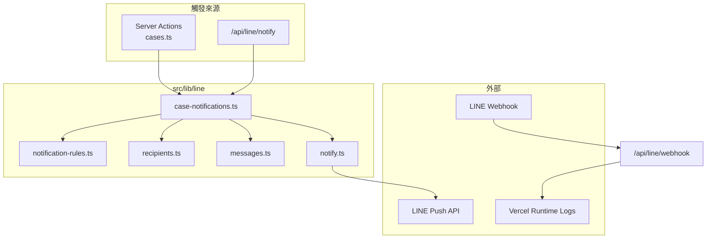
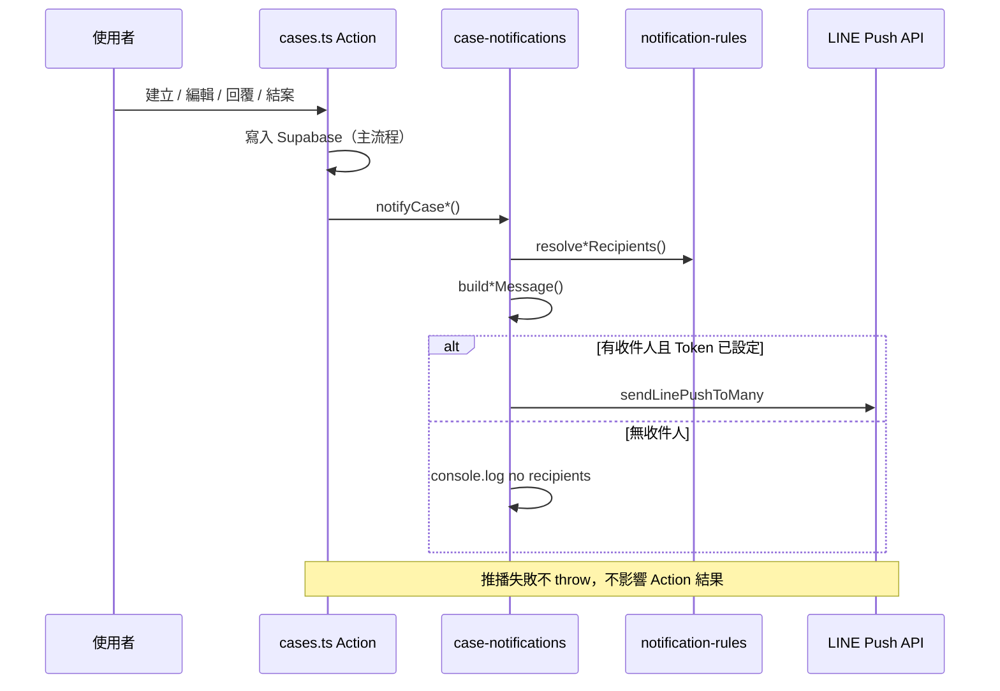

# Grevia LINE 通知（V1）

本文件說明 Grevia 客服案件追蹤平台的 LINE Messaging API 整合：架構、環境變數、收件人規則、測試與案件通知流程。

**V1 範圍**

- Push Message 案件通知（建立、指派部門、回覆、結案）
- Webhook 除錯 log（取得 `line_user_id`）
- 管理員於 `/users` 手動綁定 `users.line_user_id`

**V1 尚未實作**

- LINE Login 自動綁定
- Webhook 自動寫入 `users.line_user_id`
- 推播紀錄表（DB migration）

---

## 模組架構

```
src/lib/line/
├── notify.ts              # Push API 底層（sendLinePush、isLineConfigured）
├── profile.ts             # LINE Profile API（follow 時取 displayName）
├── recipients.ts          # 查使用者、部門篩選、line_user_id 去重
├── notification-rules.ts  # ★ 收件人規則（調整通知對象只改此檔）
├── messages.ts            # 推播文字模板
└── case-notifications.ts  # 四種事件入口（notifyCaseCreated 等）

src/app/api/line/
├── webhook/route.ts       # LINE Webhook（signature 驗證 + debug log）
├── notify/route.ts        # 手動觸發案件通知（需 secret）
└── test/route.ts          # 單一使用者 Push 測試

src/app/actions/cases.ts   # 案件操作後呼叫 case-notifications（不含規則邏輯）
```



---

## Webhook 架構

### 端點

| 方法 | 路徑 | 用途 |
|------|------|------|
| `POST` | `/api/line/webhook` | 接收 LINE 事件（follow、message 等） |
| `GET` | `/api/line/webhook` | 健康檢查，回 `{ ok: true }` |

### LINE Developers 設定

1. **Messaging API** → Webhook URL（**勿加尾隨斜線**）：
   ```
   https://{你的網域}/api/line/webhook
   ```
2. **Use webhook** = ON
3. 按 **Verify** 驗證（須直接回 **200**，不可 308 redirect）

專案已在 `next.config.ts` 設定 `trailingSlash: false`、`skipTrailingSlashRedirect: true`，並在 middleware 將 `/api/.../` 內部 rewrite 至無斜線路徑，避免 LINE POST 收到 308。

### 請求處理流程

1. 讀取 `LINE_CHANNEL_SECRET`；未設定 → **503**
2. 讀取 body 與 `x-line-signature`
3. 若有 signature → HMAC-SHA256 驗證；失敗 → **401**
4. 解析 `events[]`，對每個 event 寫入 **Vercel Runtime Logs**
5. 回 `{ ok: true }`（**200**）

### Webhook Log 格式（Vercel Logs）

每個含 `source.userId` 的事件會輸出：

```
[LINE webhook] type: follow
[LINE webhook] userId: U1234567890abcdef1234567890ab
[LINE webhook] event: {"type":"follow","source":{"type":"user","userId":"U..."},...}
[LINE webhook] displayName: Jess
```

| Log 行 | 說明 |
|--------|------|
| `type:` | 事件類型（`follow` / `message` / `postback` 等） |
| `userId:` | LINE User ID，用於填入 `users.line_user_id` |
| `event:` | 完整 event JSON |
| `displayName:` | 僅 `follow` 且 Profile API 成功時 |

**注意：** LINE Verify 的測試 POST 通常沒有 `events`，不會出現 userId log。需使用者**加 Bot 好友**或**傳訊息**才會觸發。

### Webhook 目前不做的事

- 不自動更新 `users.line_user_id`
- 不回覆使用者訊息
- 不觸發案件通知

---

## `users.line_user_id` 用途

### 資料庫

- 欄位：`public.users.line_user_id`（`TEXT`，可為 null）
- 管理介面：`/users` → 編輯使用者 → **LINE User ID**

### 推播前提

1. 使用者須為 **`is_active = true`**
2. **`line_user_id` 非空**（通常以 `U` 開頭）
3. 使用者須已**加 Grevia Bot 為好友**（否則 Push API 可能失敗）

### 取得方式（V1 手動）

1. 使用者加 Bot 好友或傳訊息
2. 至 **Vercel** → 專案 → **Logs** / **Runtime Logs**
3. 搜尋 `[LINE webhook] userId:`
4. Admin 複製 `U...` 至 `/users` 該使用者的 **LINE User ID** 欄位

### 在通知流程中的角色

`notification-rules.ts` 依部門／角色／建立者，從啟用使用者中篩選具 `line_user_id` 者，再經 `uniqueLineUserIds()` 去重後推播。

---

## Notification Rules

**所有「通知誰」的邏輯集中於** `src/lib/line/notification-rules.ts`。  
Server Actions 只呼叫 `case-notifications.ts`，**不**內嵌收件人判斷。

調整規則範例：要關閉「非客服回覆 → 通知客服部」，只改 `resolveCaseRepliedRecipients()`。

### 共通篩選條件

- 僅 `is_active = true` 的使用者（`recipients.fetchActiveUsers()`）
- 僅 `line_user_id` 非空
- 同一事件多人推播時 **`line_user_id` 去重**
- 無收件人 → **只 log，不 throw**（不影響案件主流程）

### 規則一覽

| 事件 | 函式 | 收件人 |
|------|------|--------|
| **案件建立** | `resolveCaseCreatedRecipients` | 建立時**已指派部門** → 該部門所有符合條件者；**未指派** → `業務部-客服` 所有符合條件者 |
| **指派部門** | `resolveDepartmentAssignedRecipients` | 案件**目前 department** 所有符合條件者（編輯案件、部門變更時觸發） |
| **處理回覆** | `resolveCaseRepliedRecipients` | 回覆者**非** admin 且**非**客服部 → 通知 `業務部-客服`；回覆者為 admin 或客服部 → 通知案件**目前 department**（department 為空則不通知，只 log） |
| **案件結案** | `resolveCaseClosedRecipients` | 僅 **`created_by_id` 對應使用者**（須有 `line_user_id`，否則 skip + log） |

### 建立 vs 指派部門

- **建立案件**且建立時已選部門 → 只發「案件建立」通知，**不重複**發「指派部門」
- **編輯案件**導致 department 變更（含由空 → 有部門、A → B）→ 發「指派部門」通知

### 推播訊息格式

模板見 `src/lib/line/messages.ts`，每則包含：

- 事件標題（【新案件建立】等）
- 案件編號、客戶姓名、狀態
- 摘要
- 連結：`{NEXT_PUBLIC_APP_URL}/cases/{id}`

---

## 案件通知流程



| 使用者操作 | Server Action | 通知函式 |
|------------|---------------|----------|
| 建立案件 | `createCaseAction` | `notifyCaseCreated` |
| 編輯案件（部門變更） | `updateCaseAction` | `notifyDepartmentAssigned` |
| 送出處理回覆 | `addReplyAction` | `notifyCaseReplied` |
| 結案 | `closeCaseAction` | `notifyCaseClosed` |

### Runtime Log（推播）

```
[LINE notifyCaseCreated] pushing to 2 recipient(s) for case CS-20260608-0123
[LINE notifyCaseCreated] no recipients for case CS-20260608-0123
[LINE notifyCaseReplied] no recipients for case CS-... { actorRole, actorDept, caseDept }
[LINE notifyCaseClosed] creator has no line_user_id, skipping case CS-...
```

---

## Vercel Environment Variables

於部署平台的環境變數設定，正式站目前使用 **Cloudflare Workers**。

### 必要（推播 + Webhook）

| 變數 | 用途 | 必填 |
|------|------|------|
| `LINE_CHANNEL_ACCESS_TOKEN` | Push Message、Profile API | 推播必填 |
| `LINE_CHANNEL_SECRET` | Webhook signature 驗證 | Webhook 必填 |
| `NEXT_PUBLIC_APP_URL` | 推播訊息內案件連結 | 建議設定 |

### 選用

| 變數 | 用途 |
|------|------|
| `NEXT_PUBLIC_LINE_OFFICIAL_ACCOUNT_ID` | 綁定頁產生「加入 LINE 好友」與預填綁定訊息連結，例如 `@linedevelopers` |
| `LINE_NOTIFY_INTERNAL_SECRET` | 保護 `POST /api/line/notify` |
| `LINE_USER_ID` | `GET /api/line/test` 單一對象測試推播 |

### 與 Supabase 共用（非 LINE 專用，但推播查使用者需要）

| 變數 | 用途 |
|------|------|
| `NEXT_PUBLIC_SUPABASE_URL` | 查 `users` 表 |
| `NEXT_PUBLIC_SUPABASE_ANON_KEY` | Server 端 Supabase client |
| `SUPABASE_SERVICE_ROLE_KEY` | 使用者管理（非 LINE 推播直接依賴） |

### 本地開發

複製 `.env.example` 為 `.env.local` 並填入相同變數。修改 env 後需**重啟** `npm run dev`；部署平台變更後需**重新 deploy**。

---

## LINE 測試流程

### 1. Webhook Verify

1. 確認 Vercel 已 deploy 且 `LINE_CHANNEL_SECRET` 已設定
2. LINE Developers → Webhook URL → **Verify**
3. 成功即表示 `POST /api/line/webhook` 回 200

### 2. 取得 LINE User ID

1. 用手機加 Bot 好友或傳「測試」
2. Vercel → **Logs** → 搜尋 `[LINE webhook] userId:`
3. 至 `/users` 填入該使用者的 **LINE User ID**

### 3. Push 連線測試（`/api/line/test`）

設定 `LINE_CHANNEL_ACCESS_TOKEN` 與 `LINE_USER_ID`（測試對象的 `U...`）。

```bash
curl "https://{你的網域}/api/line/test"
```

成功時手機收到：

```
🎉 Grevia 客服系統 LINE 通知測試成功！
```

回應 JSON：`{ "ok": true }`

### 4. 手動觸發案件通知（`/api/line/notify`）

需設定 `LINE_NOTIFY_INTERNAL_SECRET`。

```bash
curl -X POST "https://{你的網域}/api/line/notify" \
  -H "Authorization: Bearer {LINE_NOTIFY_INTERNAL_SECRET}" \
  -H "Content-Type: application/json" \
  -d '{"type":"case_created","caseId":"{案件 UUID}"}'
```

| `type` | 說明 | 額外參數 |
|--------|------|----------|
| `case_created` | 案件建立通知 | — |
| `department_assigned` | 指派部門通知 | — |
| `case_replied` | 處理回覆通知 | `actorId`（必填）、`replyContent`（選填） |
| `case_closed` | 結案通知 | — |

`GET /api/line/notify` 可查看 `configured`、`types` 等狀態（無需 secret）。

### 5. 端到端案件流程測試

| 步驟 | 操作 | 預期 |
|------|------|------|
| 1 | 測試帳號設好 `line_user_id`、部門正確 | — |
| 2 | 客服建立案件（未指派部門） | 客服部有 `line_user_id` 者收到「新案件建立」 |
| 3 | 編輯案件、指派部門 | 該部門有 `line_user_id` 者收到「案件指派部門」 |
| 4 | 部門人員送出回覆 | 客服部收到「處理回覆」（依規則） |
| 5 | 結案 | 案件建立者收到「案件結案」（須有 `line_user_id`） |

---

## 疑難排解

| 現象 | 可能原因 |
|------|----------|
| Webhook Verify 308 | URL 含尾隨斜線或舊部署；確認 URL 為 `/api/line/webhook` 且已 deploy 最新版 |
| Verify 成功但無 userId log | 尚未加好友／傳訊息；Verify 本身不產生 user 事件 |
| `no recipients for case` | 該部門無人設定 `line_user_id`，或不符合 notification-rules |
| Push 失敗 401/403 | `LINE_CHANNEL_ACCESS_TOKEN` 錯誤或過期 |
| Push 失敗（使用者收不到） | 未加 Bot 好友、或 `line_user_id` 填錯 |
| 訊息無連結 | `NEXT_PUBLIC_APP_URL` 未設定 |

---

## 相關檔案速查

| 檔案 | 說明 |
|------|------|
| `src/lib/line/notification-rules.ts` | 修改收件人規則 |
| `src/lib/line/messages.ts` | 修改推播文字 |
| `src/app/api/line/webhook/route.ts` | Webhook log 行為 |
| `src/app/actions/cases.ts` | 通知觸發時機 |
| `.env.example` | 環境變數範本 |

---

## 驗證紀錄

| 項目 | 狀態 |
|------|------|
| Webhook Verify | 已通過 |
| Push Message 測試 | 已通過 |
| 客服案件建立通知 | 已通過 |

最後更新：2026-06-08
